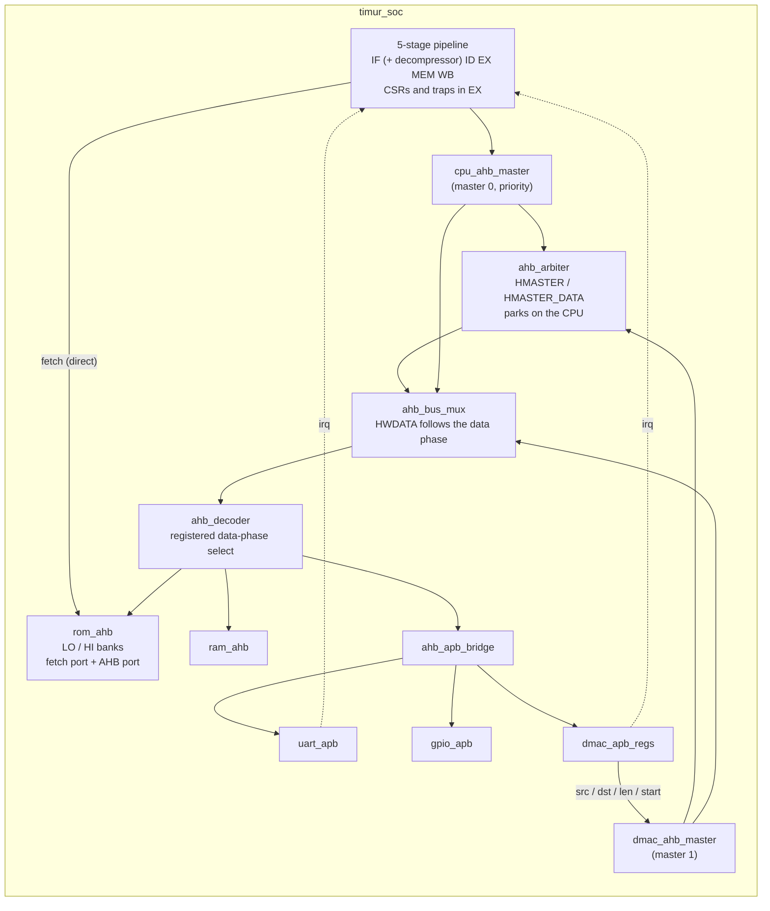

# Timur-RV32IMC

> A pipelined RISC-V RV32IMC microcontroller in Verilog-2001 for the Terasic DE10-Lite (Intel MAX 10), with a Harvard instruction-fetch port, an AHB-Lite/APB bus fabric with DMA, GPIO and UART. *Timur* means "iron" in Old Turkic.

---

## Table of Contents

- [Timur-RV32IMC](#timur-rv32imc)
  - [Table of Contents](#table-of-contents)
  - [Overview](#overview)
  - [Architecture](#architecture)
  - [ISA Support](#isa-support)
  - [Current Status](#current-status)
  - [Module Structure](#module-structure)
    - [Phase 1 — Primitives and Verification Infrastructure](#phase-1--primitives-and-verification-infrastructure)
    - [Phase 2 — Execution Datapath](#phase-2--execution-datapath)
    - [Phase 3 — State and Memory](#phase-3--state-and-memory)
    - [Phase 4 — Instruction Decode and Control](#phase-4--instruction-decode-and-control)
    - [Phases 5–7 — Pipeline and Hazard Resolution](#phases-57--pipeline-and-hazard-resolution)
    - [Phase 8 — APB Peripherals](#phase-8--apb-peripherals)
    - [Phase 9 — AHB Bus Fabric and System](#phase-9--ahb-bus-fabric-and-system)
    - [Phase 10 — CSRs, Traps and Machine Mode](#phase-10--csrs-traps-and-machine-mode)
    - [Phase 11 — C Extension](#phase-11--c-extension)
    - [Phase 12 — C Software Layer](#phase-12--c-software-layer)
  - [Address Map](#address-map)
  - [Pipeline Design](#pipeline-design)
  - [Hazard Handling](#hazard-handling)
  - [Peripherals](#peripherals)
    - [GPIO](#gpio)
    - [UART](#uart)
    - [DMAC](#dmac)
  - [Tool Stack](#tool-stack)
  - [Simulation](#simulation)
    - [Running all tests](#running-all-tests)
    - [Testbench conventions](#testbench-conventions)
    - [System tests and test programs](#system-tests-and-test-programs)
    - [C programs](#c-programs)
    - [Regenerating vectors and images](#regenerating-vectors-and-images)
  - [Building \& Programming](#building--programming)
  - [C Software Layer](#c-software-layer)
  - [Development Phases](#development-phases)
  - [Directory Structure](#directory-structure)
  - [License](#license)

---

## Overview

| Item | Value |
| ---- | ----- |
| ISA | RV32IMC + Zicsr, machine mode only: precise traps, machine external interrupt |
| Pipeline | 5-stage in-order: IF, ID, EX, MEM, WB; full forwarding; control transfers and traps resolved in EX |
| Instruction path | Dedicated fetch port into the on-chip ROM (Harvard fetch, never waits for the bus); 16-bit instructions expanded in IF |
| Data path | AHB-Lite slaves behind a two-master arbiter (CPU data port with priority, DMAC) using AMBA 2-style HBUSREQ/HGRANT arbitration; APB peripherals behind a bridge |
| Memory | 64 KB instruction ROM (two 16-bit banks) + 64 KB data RAM in M9K blocks |
| Peripherals | GPIO (LEDs, switches), UART (115200 8N1), DMA controller; UART receive and DMA done can interrupt |
| Software | C with newlib-nano: startup code, trap handler and system calls on the UART console |
| Board | Terasic DE10-Lite, Intel MAX 10 `10M50DAF484C7G` |
| Clock | 50 MHz from ALTPLL; Fmax 52.5 MHz (Slow 1200mV 85C model, setup slack +0.96 ns) |

---

## Architecture



The board wrapper `Timur_RV32IMC` contains only `cpu_pll`, the reset gating (button AND PLL locked), `reset_sync` and `timur_soc`. Testbenches instantiate `timur_soc` and drive its clock and reset directly.

---

## ISA Support

| Extension | Description | Status |
| --------- | ----------- | ------ |
| **RV32I** | Base integer instructions; FENCE, FENCE.I and WFI execute as NOPs | ✅ Phases 2–7 |
| **RV32M** | MUL, MULH, MULHSU, MULHU (2 cycles), DIV, DIVU, REM, REMU (35 cycles) | ✅ Phase 2 |
| **Zicsr** | CSRRW, CSRRS, CSRRC and the immediate forms, atomic in EX | ✅ Phase 10 |
| **Machine mode** | `mstatus`, `misa`, `mie`, `mtvec` (direct), `mscratch`, `mepc`, `mcause`, `mtval`, `mip`, 64-bit `mcycle`/`minstret` with read-only `cycle`/`time`/`instret`, ID CSRs; precise traps; ECALL, EBREAK, MRET; machine external interrupt | ✅ Phase 10 |
| **RV32C** | Every RV32C instruction (no F/D forms), expanded in IF; 32-bit instructions on any halfword boundary | ✅ Phase 11 |

Traps are taken in EX: the older instructions complete, the trapping one and the two younger ones are cancelled, and fetch continues at `mtvec`.

| `mcause` | Cause | `mtval` |
| -------- | ----- | ------- |
| `0x8000000B` | Machine external interrupt: UART `rx_valid` with `rx_irq_enable`, or DMAC done with `irq_enable`; taken when `mstatus.MIE` and `mie.MEIE` are set and no MUL or DIV is in EX | 0 |
| 2 | Illegal instruction, including `0x0000`/`0x00000000` (the fill of unused ROM), reserved 16-bit encodings, unimplemented CSRs and writes to read-only CSRs | 0 |
| 3 | EBREAK, C.EBREAK | PC |
| 11 | ECALL | 0 |
| 4 | Misaligned load: LW not on a 4-byte boundary, LH/LHU at an odd address | address |
| 6 | Misaligned store: SW, SH as above | address |

A trap saves the PC in `mepc` and `MIE` in `MPIE`, and clears `MIE`; MRET returns to `mepc` and restores `MIE`. With the C extension every branch and jump target is 2-byte aligned, so instruction-address-misaligned (cause 0) cannot occur. `misa` reads `0x40001104` (RV32IMC).

---

## Current Status

**Phases 1–12 implemented and verified in simulation; timing closed at 50 MHz.**

| Phase | Description | Status |
| ----- | ----------- | ------ |
| 1 | Primitives and verification infrastructure | ✅ Simulation |
| 2 | Execution datapath | ✅ Simulation |
| 3 | State and memory | ✅ Simulation |
| 4 | Decode and control | ✅ Simulation |
| 5 | Single-cycle integration | ✅ Simulation (superseded by the pipeline) |
| 6 | Five-stage pipeline | ✅ Simulation |
| 7 | Hazard resolution | ✅ Simulation |
| 8 | APB peripherals | ✅ Simulation |
| 9 | AHB fabric and system | ✅ Simulation |
| 10 | CSRs, traps, machine mode | ✅ Simulation |
| 11 | C extension | ✅ Simulation |
| 12 | C software layer | ✅ Simulation (C programs run on the SoC in `timur_sw_tb`) |

Full compile of the RV32IMC design with Quartus Prime 25.1std (Standard Edition; the Lite Edition supports the same device), `OPTIMIZATION_MODE "HIGH PERFORMANCE EFFORT"` and physical synthesis (combinational, register duplication, retiming), three fitter seeds:

| Seed | Setup slack, Slow 1200mV 85C | Fmax | Worst hold slack (Fast 1200mV 0C) |
| ---- | ---------------------------- | ---- | --------------------------------- |
| 1 (default) | +0.960 ns | 52.52 MHz | +0.156 ns |
| 2 | +0.943 ns | 52.47 MHz | +0.161 ns |
| 3 | +0.725 ns | 51.88 MHz | +0.160 ns |

Resources: 5,848 logic elements (12 %), 128 of 182 M9K blocks (1,048,576 bits: the two ROM banks and the four RAM byte lanes), 8 embedded multiplier 9-bit elements. The critical path runs from a RAM load in WB through the load formatter and the forwarding mux into the branch comparator's carry chain, then through the fetch decision into the ROM bank address registers (see [Pipeline Design](#pipeline-design)).

Still open:

- On the board: LEDs follow software, UART output readable, DMA checksum, the C programs (see [Building & Programming](#building--programming)).
- riscv-arch-test RV32IMC and Zicsr suites (RISCOF flow).

---

## Module Structure

### Phase 1 — Primitives and Verification Infrastructure

- **`mux2`, `mux4`** — parameterised multiplexers (default `WIDTH` 32).
- **`d_ff`** — D flip-flop with enable and asynchronous active-low reset.
- **`reset_sync`** — two-flop reset synchroniser: asynchronous assertion, release on the second rising edge.
- **`cpu_pll`** — ALTPLL (50 MHz in, `c0` 50 MHz out, `areset` and `locked` used). Added to the project through `cpu_pll.qip`; `cpu_pll_bb.v` is excluded from synthesis and simulation.
- **`run_tests.tcl` / `run_tests.bat`** — ModelSim regression runner (see [Simulation](#simulation)); `Timur_RV32IMC.sdc` — timing constraints.

### Phase 2 — Execution Datapath

- **`adder_32bit`** — add/subtract; B is inverted with an XOR against `sub`, which is also the carry-in (carried in an extra low bit, so the sum is one carry chain). Outputs `cout` (1 = no borrow) and signed `overflow`.
- **`barrel_shifter`** — a left and a right shifter side by side, each five cascaded `mux2` stages (one `shamt` bit per stage); a final `mux4` on `shift_type` picks the result. Every stage is one 2:1 mux deep. The right shifter fills with the original `in[31]` for SRA.
- **`multiplier`** — two cycles: both operands are extended to 33 bits with a sign bit or zero, and one signed 33×33 multiply serves MUL, MULH, MULHSU and MULHU. `start` registers the extended operands in the first EX cycle (the embedded multipliers' input registers) and the product is formed from them in the second, so late forwarded load data never passes through the multiply array in the same cycle. `done` is a level held until `ack`, as in the divider.
- **`divider`** — restoring divider, 32 iterations; divide by zero and `0x80000000 / -1` take a fast path. The DIV sits in EX for 35 cycles (2 on the fast path). `done` is a level held until `ack` (the DIV leaving EX), so it is never lost in a bus freeze.
- **`alu`** — 5-bit `ALUControl` including SLTU (`01100`); shift type decoded explicitly; `zero` computed after the result mux. The multiplier and the divider are started with `mul_start` / `div_start` and acknowledged with `mul_ack` / `div_ack` from the hazard unit.
- **`branch_condition_evaluator`** — decides BEQ, BNE, BLT, BGE, BLTU, BGEU from two compare results, `equal` and `less`. The pipeline instantiates it three times with constant inputs (equal, less, greater) and lets the late compare results pick one decision (see [Pipeline Design](#pipeline-design)).

### Phase 3 — State and Memory

- **`pc`** — 32-bit `d_ff`, enable = `pc_load`; all next-PC selection lives outside it.
- **`registers`** — 32×32 array `regs` in logic, asynchronous reads, x0 forced to 0 through a `mux2` per port, and a write-through bypass: a same-cycle WB write is returned on the read ports.
- **`rom_ahb`** — 64 KB as two 16384×16 banks: LO holds the halfwords at byte offsets 0 mod 4, HI those at 2 mod 4 (`ram_init_file` `rom_lo.mif` / `rom_hi.mif` for synthesis; zero fill plus `rom_lo.hex` / `rom_hi.hex` in simulation). Fetch port: the 32 bits at byte address A are LO[(A + 2) >> 2] and HI[A >> 2], ordered by A[1], so any halfword-aligned window — a 16-bit instruction or a 32-bit one straddling two words — is read in one cycle. AHB port: `{HI[w], LO[w]}` for loads and DMAC reads (writes ignored).
- **`ram_ahb`** — four 16384×8 byte lanes; synchronous read in the address phase, write in the data phase on the enabled lanes, read-after-write bypass for a load right behind a store to the same word, raw 32-bit `HRDATA`.
- **AHB-Lite slave convention** — every slave has an `HREADY` input and an `HREADYOUT` output and accepts an address phase only with `HSEL & HTRANS[1] & HREADY`.
- **`store_aligner`** (MEM) and **`load_formatter`** (WB) — byte/halfword replication for stores, lane selection and sign/zero extension for loads. `HSIZE` carries only the size.

### Phase 4 — Instruction Decode and Control

- **`instr_parser`** — field slicing (`opcode`, `rd`, `funct3`, `rs1`, `rs2`, `funct7`).
- **`imm_gen`** — I, S, B, U, J immediates (bit 0 of B and J is 0).
- **`alu_decoder`** — uses opcode bit 5 (`op5`): for I-type arithmetic `funct7` holds immediate bits, so `ADDI x1, x0, -5` stays ADD and `ADDI x1, x0, 40` does not become MUL.
- **`main_control_unit`** — `RegWrite`, `ALUSrcA` (rs1 / PC / zero), `ALUSrcB`, `ALUOp`, `MemRead`, `MemWrite`, `MemToReg`, `Branch`, `Jump`, `Jalr`, `CSRAccess`, `CSROp`, `CSRImm`, `IsECALL`, `IsEBREAK`, `IsMRET`, `Illegal`. SYSTEM is decoded on the full `funct12` (ECALL, EBREAK, MRET, WFI as NOP); FENCE and FENCE.I are NOPs; reserved encodings raise `Illegal` and force every side-effect control to 0.

### Phases 5–7 — Pipeline and Hazard Resolution

The datapath lives in **`timur_soc`**:

- **Fetch** — IF computes PC + 2 and PC + 4. Bits [1:0] of the fetch window tell a 16-bit instruction (expanded by the `decompressor`) from a 32-bit one and pick the sequential next PC. The ROM bank addresses are an index triple {LO index, HI index, A[1]}, computed separately for every candidate — hold, PC + 2, PC + 4, the redirect target and `mtvec` — and the final mux picks one; reset forces address 0. The ROM registers the same address as the PC register, so the fetch window always belongs to the current PC and is re-read while the PC holds.
- **`if_id_reg`, `id_ex_reg`, `ex_mem_reg`, `mem_wb_reg`** — common interface (`clk`, `rst_n`, `enable`, `flush`) and a `valid` bit; priority reset → flush (bubble) → hold → capture. A bubble has every side-effect control 0; in IF/ID it holds the NOP `0x00000013`. IF/ID and ID/EX also carry `is_compressed`.
- **EX** — forwarding muxes, `ALUSrcA`/`ALUSrcB`, ALU, branch compare and evaluation, targets, CSR access, trap decision, redirect, result mux (PC + 2 or PC + 4 for JAL/JALR links, the CSR's old value for CSR instructions).
- **MEM / WB** — the AHB address phase is issued in MEM and the data phase completes in WB; MEM/WB does not capture load data.
- **`forwarding_unit`** — 00 ID/EX value, 01 WB value, 10 EX/MEM result; EX/MEM wins; never for x0.
- **`hazard_detection_unit`** — produces every enable and flush; see [Hazard Handling](#hazard-handling).

### Phase 8 — APB Peripherals

- **`gpio_apb`** — GPIO_OUT (LEDs), GPIO_IN (switches through a two-flop synchroniser), GPIO_DIR.
- **`uart_apb`** — 8N1 UART with a fixed divider (433 → 115,207 baud at 50 MHz); transmitter and receiver time each bit from the start of the frame, the receiver samples at bit centres, rejects glitches and framing errors, and reports `rx_overrun`; `irq` = `rx_valid` AND `rx_irq_enable`.
- **`dmac_apb_regs`** — SRC, DST, LEN, CTRL (self-clearing start, `irq_enable`), STATUS (engine busy, sticky done); `irq` = done AND `irq_enable`.

### Phase 9 — AHB Bus Fabric and System

- **`cpu_ahb_master`** — AHB master 0: NONSEQ address phase from MEM (`HBURST` SINGLE, `HPROT` 0011), `HWDATA` loaded when the address phase is accepted and held through wait states, `bus_wait` for a pending address or data phase.
- **`ahb_arbiter`** — at each rising edge with `HREADY = 1`: CPU requesting → CPU; else DMAC requesting → DMAC; else park on the CPU. Outputs `HMASTER`, `HMASTER_DATA` (data-phase owner) and `HGRANT`. No HLOCK.
- **`ahb_bus_mux`** — address/control from `HMASTER`, `HWDATA` from `HMASTER_DATA`.
- **`ahb_decoder`** — `HSEL` from `HADDR[31:16]`; `HRDATA`/`HREADY` multiplexed with a data-phase select registered when `HREADY = 1`; default slave (reads 0, writes ignored).
- **`ahb_apb_bridge`** — IDLE → SETUP → ACCESS, one wait state per APB access, APB decode on `PADDR[15:8]`, back-to-back APB transfers.
- **`dmac_ahb_master`** — IDLE, RD_ADDR, RD_DATA, WR_ADDR, WR_DATA, DONE; word copies from ROM or RAM to RAM; `LEN = 0` finishes at once; keeps its data if the CPU takes the bus between the read and the write.
- **`Timur_RV32IMC`** — board wrapper: `clk_50mhz`, `rst_btn_n`, `sw[9:0]`, `leds[9:0]`, `uart_tx`, `uart_rx`.

### Phase 10 — CSRs, Traps and Machine Mode

- **`csr_file`** (`rtl/csr/`) — the machine-mode CSRs listed under [ISA Support](#isa-support). Reads are combinational (the old value goes to rd); writes, trap entry, MRET and the counters update on the clock edge. The pipeline raises `csr_we` only in the cycle in which the CSR instruction leaves EX, so an instruction held in EX by a bus freeze writes exactly once. SET and CLEAR with rs1 = x0 (or uimm = 0) do not write. Legality comes from `csr_write_attempt`, not from the final write enable, which keeps the trap decision out of a combinational loop. `mcycle` counts every cycle and `minstret` every instruction that leaves WB; a write to either half replaces it for that cycle.
- **`trap_unit`** (`rtl/csr/`) — decides whether the instruction in EX traps and with which cause and `mtval` (table under [ISA Support](#isa-support)). The misalignment check uses a separate 2-bit adder on the address's low bits. An interrupt is held off while a MUL or DIV is in EX, so a multi-cycle operation never has to be restarted.
- **In `timur_soc`** — a trap redirects fetch to `mtvec` and cancels the instruction in EX and the two younger ones; `mepc` is the PC of the instruction in EX. MRET is an ordinary redirect to `mepc`. The external interrupt line is UART `irq` OR DMAC `irq`.

### Phase 11 — C Extension

- **`decompressor`** (`rtl/decode/`) — every RV32C instruction to its RV32I equivalent, between the fetch window and IF/ID, so decode and everything after it see only 32-bit instructions. Illegal and reserved encodings (`0x0000`, C.ADDI4SPN with a zero immediate, C.LWSP with rd = 0, C.JR with rs1 = 0, C.ADDI16SP and C.LUI with a zero immediate, the F/D forms, the RV64 C.SUBW/C.ADDW slots, RV32 shifts with shamt[5] = 1) expand to `0x00000000`, which decode flags as illegal; HINT encodings are legal. Checked against the GNU toolchain for all 49,152 16-bit encodings.
- **Split-bank ROM** — see `rom_ahb` under Phase 3.
- **In `timur_soc`** — `is_compressed` travels to EX, where the link value is PC + 2 or PC + 4. Branch and JALR targets, and `mepc`, may be on any halfword.

### Phase 12 — C Software Layer

- **`sw/linker.ld`, `sw/crt0.S`, `sw/syscalls.c`, `sw/trap.c`, `sw/timur.h`** — memory layout, startup code, newlib system calls on the UART, trap handler, register definitions.
- **`sw/build.py`** — compile, link, check and convert a C program; **`sw/bin2mem.py`** — the binary-to-memory converter. See [C Software Layer](#c-software-layer).
- **`sw/tests/`** — C programs run on the SoC by `tb/timur_sw_tb.v`.

---

## Address Map

| Range | Slave | Size | Notes |
| ----- | ----- | ---- | ----- |
| `0x0000_0000 – 0x0000_FFFF` | ROM | 64 KB | Fetch port (IF) + AHB data port (loads, DMAC reads) |
| `0x2000_0000 – 0x2000_FFFF` | RAM | 64 KB | `.data`, `.bss`, heap, stack; DMAC destination |
| `0x4000_0000 – 0x4000_00FF` | UART (APB) | 256 B | DATA `0x00`, STATUS `0x04`, CTRL `0x08` |
| `0x4000_0100 – 0x4000_01FF` | GPIO (APB) | 256 B | OUT `0x00`, IN `0x04`, DIR `0x08` |
| `0x4000_0200 – 0x4000_02FF` | DMAC registers (APB) | 256 B | SRC `0x00`, DST `0x04`, LEN `0x08`, CTRL `0x0C`, STATUS `0x10` |
| anything else | default slave | — | Reads 0, writes ignored |

APB3 has no byte strobes: peripheral registers are word-write only (a byte or halfword store writes the replicated value to the whole register), and registers are decoded on `PADDR[7:2]`.

---

## Pipeline Design

| Stage | Work | Memory / bus |
| ----- | ---- | ------------ |
| IF | Select the next PC (PC + 2, PC + 4, redirect target, `mtvec`), read the 32-bit window at the PC, expand a 16-bit instruction | ROM fetch port |
| ID | Parse, immediate, control, ALU decode, register read with WB bypass, load-use detection | — |
| EX | Forwarding, operand select, ALU, multiplier, divider, branch compare and evaluation, targets, CSR access, trap decision, redirect, result select | — |
| MEM | Store alignment; AHB address phase for loads and stores | AHB address phase |
| WB | AHB data phase, load formatting, write-back | AHB data phase |

Taken branches, JAL, JALR and MRET redirect from EX and kill exactly the two younger instructions; a trap does the same towards `mtvec` and also cancels the instruction in EX. The decision ends at the ROM bank address registers in the same cycle, so it is the longest path in the design. What keeps it within 20 ns:

- The branch compare has its own subtractor on the forwarded operands. Signed and unsigned "less" come from the same subtraction: for signed compares both sign bits are inverted first.
- Three `branch_condition_evaluator`s with constant inputs precompute the redirect for each compare outcome (equal, less, greater); the late `equal` and `less` results only select one. The fetch decision `fetch_go` (redirect or trap, and not frozen by the bus) is precomputed the same way.
- The targets have their own adders (PC + imm for branches and JAL, rs1 + imm for JALR). Each target's ROM index triple is computed from the target's low bits (target + 2 for the LO bank) in parallel with those adders, and the fetch mux takes `fetch_go` as its last select.
- Trap priority is applied on the data side (`mtvec` replaces the redirect target), not as another select level.
- `(* keep = 1 *)` on the compare results, the precomputed decisions and the index muxes stops synthesis from merging them back into one deeper cone.

---

## Hazard Handling

| Condition (highest first) | PC | IF/ID | ID/EX | EX/MEM | MEM/WB |
| ------------------------- | -- | ----- | ----- | ------ | ------ |
| Bus wait (freeze) | hold | hold | hold | hold | hold |
| Trap or interrupt | `mtvec` | bubble | bubble | bubble | advance |
| Redirect taken (branch, JAL, JALR, MRET) | target | bubble | bubble | advance | advance |
| MUL / DIV EX stall | hold | hold | hold | bubble | advance |
| Load-use | hold | hold | bubble | advance | advance |
| Normal | PC + 2 or PC + 4 | advance | advance | advance | advance |

- **Bus wait** — CPU address phase not granted or not ready, or CPU data phase with `HREADY = 0` (for example the one wait state of every APB access, or the DMAC owning the bus).
- **Trap** — taken in EX; the trapping instruction never reaches MEM, so a misaligned access never reaches the bus. An interrupt waits while a MUL or DIV is in EX.
- **Multiplier** — `mul_start = MUL in EX AND NOT done AND NOT bus_wait` registers the operands; EX stall while `NOT done` (exactly one cycle outside a bus freeze); `mul_ack` when the MUL leaves EX.
- **Divider** — `div_start = DIV in EX AND NOT busy AND NOT done AND NOT bus_wait`; EX stall while `NOT done`; `div_ack` when the DIV leaves EX.
- **Load-use** — a load in EX whose `rd` (≠ x0) matches `rs1` or `rs2` of the instruction in ID: one bubble; the value then arrives by WB forwarding.
- Instruction fetch never waits for the bus.

---

## Peripherals

### GPIO

| Offset | Register | Access | Description |
| ------ | -------- | ------ | ----------- |
| `0x00` | GPIO_OUT | R/W | Drives `LEDR[9:0]` |
| `0x04` | GPIO_IN | R | `SW[9:0]` through a two-flop synchroniser |
| `0x08` | GPIO_DIR | R/W | Reserved for header pins |

### UART

| Offset | Register | Access | Description |
| ------ | -------- | ------ | ----------- |
| `0x00` | UART_DATA | R/W | Write: byte to send (ignored while `tx_busy`). Read: received byte; clears `rx_valid` and `rx_overrun` |
| `0x04` | UART_STATUS | R | bit 0 `tx_busy`, bit 1 `rx_valid`, bit 2 `rx_overrun` |
| `0x08` | UART_CTRL | R/W | bit 0 `rx_enable`, bit 1 `rx_irq_enable` |

All UART registers reset to 0, so the receiver starts disabled; software sets `rx_enable` before the first read. With `rx_irq_enable` set, the UART requests the machine external interrupt while `rx_valid` is 1; reading UART_DATA clears it. The DE10-Lite has no USB-UART bridge: connect a **3.3 V** USB-to-TTL adapter (FT232R, CP2102 or CH340) to the GPIO header — see [Building & Programming](#building--programming).

### DMAC

| Offset | Register | Access | Description |
| ------ | -------- | ------ | ----------- |
| `0x00` | DMAC_SRC | R/W | Source byte address (word-aligned): ROM or RAM |
| `0x04` | DMAC_DST | R/W | Destination byte address (word-aligned): RAM |
| `0x08` | DMAC_LEN | R/W | Number of 32-bit words; 0 = no transfer, done set at once |
| `0x0C` | DMAC_CTRL | R/W | bit 0 start (self-clearing, ignored while busy), bit 1 `irq_enable`; any write clears done |
| `0x10` | DMAC_STATUS | R | bit 0 busy, bit 1 done (sticky) |

With `irq_enable` set, the DMAC requests the machine external interrupt while done is 1; any CTRL write clears done. Typical use: copy the `.data` section from ROM to RAM at boot, the hardware version of the `crt0` copy loop.

---

## Tool Stack

| Purpose | Tool |
| ------- | ---- |
| HDL | Verilog-2001 |
| Synthesis, fitting, timing | Quartus Prime 25.1std (Standard Edition used for the numbers above; the Lite Edition supports the 10M50), Timing Analyzer with `Timur_RV32IMC.sdc` |
| Simulation | ModelSim-Intel FPGA Starter Edition 2020.1 (standalone), driven by `run_tests.tcl`; Questa-Altera FPGA Starter Edition or Icarus Verilog 13 are acceptable replacements |
| PLL | ALTPLL via the IP Catalog (`cpu_pll.v` + `cpu_pll.qip`) |
| Memory initialisation | `rom_lo.mif` / `rom_hi.mif` (synthesis), `rom_lo.hex` / `rom_hi.hex` (simulation) and `rom.hex` (32-bit words, testbenches), all from the same program |
| Test programs | Python 3: `sw/gen_soc_tests.py` (assembler, RV32IMC reference model, vector writer), `sw/gen_sw_tests.py` (C programs), `sw/gen_unit_vectors.py` (CSR file, trap unit), `sw/gen_decompressor_vectors.py` (decompressor) |
| Software | xPack `riscv-none-elf-gcc` 14.2.0-3 (GCC 14.2, newlib-nano) |
| On-chip debug | Signal Tap Logic Analyzer |

---

## Simulation

### Running all tests

Double-click `run_tests.bat` or run it from a terminal. It changes to the project folder and starts `C:\intelFPGA\20.1\modelsim_ase\win32aloem\vsim.exe -c -do run_tests.tcl`, which:

1. collects `rtl/*.v` and `rtl/*/*.v` (dropping every `*_bb.v`) and `tb/*_tb.v`;
2. deletes, recreates and maps the `work` library;
3. compiles everything once and aborts on any compile error;
4. runs each testbench through a temporary do-file (`run -all`, `quit -sim`), with its transcript in `logs/<testbench>.log`;
5. counts a test as passed only if its log contains `ALL n TESTS PASSED` with n > 0 and no `FAIL` line — a crash, a missing vector file or a watchdog timeout leaves no summary line and fails;
6. prints a summary and deletes the temporary do-files.

Paths inside testbenches (`vectors/…`, `rom_lo.hex`) are relative to the project root. `timur_sw_tb` runs about 2 million cycles and takes the longest.

On Linux, `./run_tests.sh` does the same with Icarus Verilog (`sudo dnf install iverilog`): it compiles each testbench with the RTL (without `cpu_pll` and the board wrapper, which need the Altera megafunction library; `timur_sw_tb` also gets `tb/timur_soc_tb.v`), keeps its output in `logs/<testbench>.log`, applies the same pass rule and prints a summary. `./run_tests.sh alu_tb timur_soc_tb` runs only those. A single testbench by hand:

```bash
RTL=$(ls rtl/*/*.v | grep -v -e cpu_pll -e _bb.v -e Timur_RV32IMC.v)
iverilog -g2001 -s timur_soc_tb -o sim.vvp tb/timur_soc_tb.v $RTL && vvp -n sim.vvp
iverilog -g2001 -s timur_sw_tb  -o sim.vvp tb/timur_sw_tb.v tb/timur_soc_tb.v $RTL && vvp -n sim.vvp
```

### Testbench conventions

- One `tb/<module>_tb.v` per module and one `vectors/<module>_vectors.txt`; lines starting with `//` are comments, and lines whose field count does not match are skipped.
- Sequential vectors end with a `wait_type` column: `0` = check 3 ns after applying inputs without a clock edge, `1` = wait for the next rising edge plus 1 ns, then check. Protocol testbenches may use `x` digits in expected values for "don't care".
- Every testbench starts with `` `timescale 1ns/1ps``, has a watchdog that prints a `FAIL` line, compares with `!==`, prints one `PASS`/`FAIL` line per vector, and ends with exactly `ALL n TESTS PASSED` or `f / n TESTS FAILED` followed by `$stop`. A run with no vectors is a failure. (`decompressor_tb` prints one summary `PASS` line for its 49,152 encodings.)

### System tests and test programs

`tb/timur_soc_tb.v` runs the programs listed in `vectors/timur_soc_vectors.txt` on `timur_soc`:

| Program | Covers |
| ------- | ------ |
| `timur_soc_phase5.hex` | The Phase 5 test program (no loads) |
| `timur_soc_phase6.hex` | Loads and stores of every size and offset, JAL/JALR links, LUI/AUIPC, register-file bypass |
| `timur_soc_phase7.hex` | Forwarding, load-use, the Phase 7 walkthrough (LW, dependent ADD, DIV, taken branch), DIV/REM (including an operand from an APB load and REM by zero after an APB load), MUL (including an operand straight from a RAM load), taken branch/JAL/JALR killing exactly two instructions — once normally and once with HREADY held low for three cycles in every RAM load |
| `timur_soc_random.hex` | Random dependency-dense program (RAM and APB loads/stores, ROM loads, DIV/REM corner cases, branches, JAL, JALR), with and without HREADY waits |
| `timur_soc_system.hex` | GPIO, UART, DMA copy while the CPU runs loads and stores, DMAC STATUS busy/done, `LEN = 0`, default slave |
| `timur_soc_phase10.hex` | Every CSR instruction form, back-to-back and forwarded CSR operands, WARL fields, counters, a CSR write during a bus freeze, every trap cause with MRET back, misaligned accesses through the base register — with and without HREADY waits |
| `timur_soc_interrupt.hex` | DMAC done interrupt held off by a chain of DIVs, then taken exactly once |
| `timur_soc_phase11.hex` | Every compressed instruction, 32-bit instructions straddling two words, PC + 2 links, 16-bit traps (assembled by GNU as) — with and without HREADY waits |
| `timur_soc_random_c.hex` | Random mix of 16-bit and 32-bit instructions, many straddling, with and without HREADY waits |
| `rom.hex` | The final cross-phase program (the default ROM image) |
| `sw/bringup/bringup_*.hex` | The three hardware bring-up programs (see [Building & Programming](#building--programming)) |

Every cycle of every program the testbench also checks that the fetch window holds the 32 bits at the PC and that IF/ID holds the instruction at its PC (the expansion of a 16-bit instruction, from a reference decompressor), that each MUL gets one multiplier start and one stall cycle, that each DIV gets exactly one divider start, that each load-use costs exactly one bubble, that no misaligned access reaches the bus and that no interrupt is taken with a MUL or DIV in EX. Expected registers, RAM words and the order in which instructions leave EX come from the reference model in `sw/gen_soc_tests.py`; values that depend on timing (counters, UART and DMAC polling, interrupts) are left out of the model's checks and have hand-written ones. Add `+trace` to the simulator command line to print PC, instruction and x1–x14 every cycle.

### C programs

`tb/timur_sw_tb.v` is `timur_soc_tb` with `vectors/timur_sw_vectors.txt` and a UART of 16 cycles per bit (the programs only poll the UART's flags, so the baud rate does not change what they print). Each program in `sw/tests/` runs once built for `rv32im_zicsr` and once for `rv32imc_zicsr`; its UART output must match, byte for byte, the output of the reference model running the same image, and its exit code must appear on the LEDs. The log shows each program's output, prefixed with `  | `.

| Program | Covers |
| ------- | ------ |
| `hello.c` | `printf`, a CSR read, the switches |
| `selftest.c` | `.data`/`.sdata` initial values, `.bss`/`.sbss` zeroed, `.rodata` through the ROM's AHB port, a constructor; recursion and stack frames; `+ - * / %` including negative operands, division by zero and `INT_MIN / -1`, MULH/MULHU/MULHSU, 64-bit arithmetic and shifts; `snprintf`, `sscanf`, `strtol`, string functions, `qsort`; `malloc`/`calloc`/`realloc`, heap exhaustion returning `NULL` below the stack; ECALL system calls and register preservation; CSRs. 242 checks against values computed by the compiler or defined by the M extension, also run with HREADY waits |
| `traps.c` | Exceptions handled by the program — illegal 32- and 16-bit instructions, EBREAK and C.EBREAK, misaligned LW/LH/LHU/SW/SH — with `mcause`, `mepc` and `mtval` checked, then the runtime's report of an unhandled one (LEDs `0x302`) |
| `io.c` | Console input through `fgets`, `sscanf` and `getchar`; DMA copy from ROM with the done interrupt; a masked interrupt pending in `mip.MEIP` until `MIE` is set; a line received by the UART receive interrupt. The testbench types the input on `uart_rx` |

### Regenerating vectors and images

From the project root:

```bash
python3 sw/gen_soc_tests.py              # system tests, rom.* (default seed 20260926); --seed N for another random program
python3 sw/gen_sw_tests.py               # C programs: builds sw/tests/*.c, runs the model, writes vectors/timur_sw_*
python3 sw/gen_unit_vectors.py           # csr_file and trap_unit vectors
python3 sw/gen_decompressor_vectors.py   # all 16-bit encodings, expanded by the GNU toolchain
```

`gen_decompressor_vectors.py` needs the RISC-V toolchain. `gen_soc_tests.py` needs it for the Phase 11 programs and `gen_sw_tests.py` for the C programs; without it they reuse the committed images and still regenerate the expectations.

---

## Building & Programming

1. Open `Timur_RV32IMC.qpf` in Quartus Prime 25.1std.
2. Run **Processing → Start Compilation**.
3. Check **Timing Analyzer → Slow 1200mV 85C Model → Setup Summary / Fmax Summary**: slack must be positive, with 0 illegal and 0 unconstrained clocks.
4. Check **Fitter → Resource Section → RAM Summary** for the 128 M9K blocks and **Flow Summary** for the Embedded Multiplier 9-bit elements.
5. Program the `.sof` from `output_files/` with **Tools → Programmer**.

Pins (DE10-Lite golden top, 3.3-V LVTTL):

| Port | Board signal |
| ---- | ------------ |
| `clk_50mhz` | `MAX10_CLK1_50` (PIN_P11) |
| `rst_btn_n` | `KEY[0]` (PIN_B8), active low |
| `sw[9:0]` | `SW[9:0]` |
| `leds[9:0]` | `LEDR[9:0]` |
| `uart_tx` | `GPIO[0]` (PIN_V10), header pin 1 → adapter RX |
| `uart_rx` | `GPIO[1]` (PIN_W10), header pin 2 ← adapter TX |

Use a 3.3 V adapter only (never 5 V) and connect its ground to a GND pin of the GPIO header. Terminal settings: 115200 8N1, no flow control; the C runtime sends CR LF for every newline and accepts CR (Enter) as the end of a line.

The ROM contents come from `rom_lo.mif` and `rom_hi.mif` in the project root. Hardware bring-up order — for steps 1–3 copy the program's `_lo.mif` and `_hi.mif` over `rom_lo.mif` and `rom_hi.mif` (and its `_lo.hex`/`_hi.hex` over `rom_lo.hex`/`rom_hi.hex` for simulation), for steps 5 and 6 run `sw/build.py --install`, then recompile:

| Step | Program | Expected on the board |
| ---- | ------- | --------------------- |
| 1 | `sw/bringup/bringup_1_gpio_lo/_hi.mif` | LEDs mirror the switches; with every switch off they show `0x2A5` |
| 2 | `sw/bringup/bringup_2_uart_lo/_hi.mif` | `UUUU…` in the terminal, a square wave on `uart_tx` |
| 3 | `sw/bringup/bringup_3_dma_lo/_hi.mif` | DMA copies four ROM words to RAM; the LEDs show the checksum's low bits `0x2AA` |
| 4 | `rom_lo.mif` / `rom_hi.mif` as shipped | Final cross-phase program: LEDs show 42 (`0b00_0010_1010`), one `U` on the UART |
| 5 | `python3 sw/build.py --install sw/tests/hello.c` | `Hello from Timur RV32IMC!`, `misa`, the switch value; then LEDR9 lights (exit code 0) |
| 6 | `python3 sw/build.py --install sw/tests/selftest.c` (or `io.c`, which asks for input) | `all 242 checks passed`; LEDs `0x200` |

`python3 sw/gen_soc_tests.py` restores the shipped ROM image.

A new ROM image does not need a full compilation: after one full compilation in the project folder, **Processing → Update Memory Initialization File** followed by **Processing → Start → Start Assembler** rebuilds the `.sof` and `.pof` with the new `rom_lo.mif`/`rom_hi.mif` in a few seconds (from a terminal: `quartus_cdb Timur_RV32IMC -c Timur_RV32IMC --update_mif`, then `quartus_asm Timur_RV32IMC -c Timur_RV32IMC`). Timing does not change, since only memory contents do. `sw/program_board.sh` does all of it and programs the board: it swaps the ROM contents into the last compilation (or runs a full compilation when there is none, or when a file in `rtl/`, the `.qsf` or the `.sdc` is newer than the last fit, and stops on negative slack), then programs the `.sof` over JTAG; `--flash` programs the `.pof` into the configuration flash instead, so the design survives power-off.

---

## C Software Layer

| File | Role |
| ---- | ---- |
| `sw/timur.h` | Peripheral registers, CSR access macros, trap interface, raw UART helpers |
| `sw/linker.ld` | Memory layout (below); `__stack_size` (default 8 KB) can be changed with `-Wl,--defsym=__stack_size=N` |
| `sw/crt0.S` | Startup code, `_halt`, and `trap_entry` (saves the caller-saved registers, calls `timur_trap`, MRET) |
| `sw/syscalls.c` | newlib system calls: the UART is `stdin`, `stdout` and `stderr`; heap for `malloc`; `_exit` |
| `sw/trap.c` | Trap dispatch: ECALL system calls, `irq_handler`, `exception_handler`, the report of unhandled traps |
| `sw/build.py` | Compile, link, check and convert a program |
| `sw/bin2mem.py` | Binary-to-memory converter |
| `sw/run_model.py` | Run a built program on the reference model; write a vector file to run it on the RTL |

**Memory layout.** ROM (`0x0000_0000`, 64 KB): `.text` from address 0 (`_start` first), `.rodata`/`.srodata`, `.init_array`, then the load image of `.data`. RAM (`0x2000_0000`, 64 KB): `.data`/`.sdata` (copied at boot), `.sbss`/`.bss` (cleared at boot), the heap from `_end` up to `_heap_end`, and the stack (`__stack_size` bytes below `_stack_top` = `0x2001_0000`). `gp` points at the small data plus `0x800`. The script asserts that the image fits in the ROM and that `.data` and `.bss` leave room for the stack.

**Startup (`crt0.S`).** Load `gp` (with linker relaxation off for that instruction), set `sp`, point `mtvec` at the 4-byte-aligned `trap_entry`, copy `.data` from ROM to RAM a word at a time, clear `.bss`, run the constructors, call `main(0, NULL)` and pass its result to `exit`, which flushes `stdout` and ends in `_exit`.

**Console.** `_write` waits for `tx_busy` to clear before each byte and turns `\n` into `\r\n`; `_read` enables the receiver, waits for each byte, turns `\r` into `\n` and returns at the end of a line. `stdout` is line buffered. `_sbrk` fails with `ENOMEM` instead of growing into the stack. `_exit(code)` shows `0x200 | code` on the LEDs (LEDR9 = the program has ended) and stops in `_halt`, a jump to itself.

**Traps.** `trap_entry` saves `ra`, `t0`–`t6` and `a0`–`a7` on the stack and calls `timur_trap` with interrupts disabled (the hardware cleared `MIE`):

- ECALL: system call `a7` with arguments `a0`–`a2` — 63 `read`, 64 `write`, 93 `exit`, anything else returns `-ENOSYS`. The result goes into the saved `a0` and `mepc` advances by 4. `timur_ecall()` in `timur.h` makes the call from C.
- External interrupt: `irq_handler(mcause)`, which the program defines and which must clear the source (read UART_DATA, write DMAC_CTRL).
- Any other exception: `exception_handler(frame, mcause, &mepc, mtval)`; returning 1 resumes at the (updated) `mepc`.
- Without a handler, the runtime prints `*** unhandled trap: <cause>` with `mcause`, `mepc` and `mtval` over the UART and exits with `0x100 | cause` (LEDs `0x300 | cause`).

**Building.** `python3 sw/build.py [--march rv32im_zicsr|rv32imc_zicsr] [-O2] [--install] program.c [more.c …]` compiles with `-march=… -mabi=ilp32 -O2 -ffunction-sections -fdata-sections -nostartfiles -T sw/linker.ld --specs=nano.specs -Wl,--gc-sections -Wl,-Map=…`, links through the `gcc` driver, and writes `sw/build/<name>/` (`.elf`, `.map`, `.lst`, `.bin`, `.hex` and the `_lo`/`_hi` banks). It stops if the C library is not the one for the chosen ISA (`-print-multi-directory` must print `rv32im/ilp32` or `rv32imc/ilp32`, never the default, which contains A-extension instructions), if `.text` does not start at 0, if `.data` does not run in RAM and load from ROM, or if the binary exceeds 64 KB. `--install` also writes `rom.hex` and `rom_lo`/`rom_hi` `.hex`/`.mif` in the project root. `--stack-size N` changes the stack reserved below the end of RAM (default 8192 bytes), and `--extra=OPTION` passes one more option to gcc after the sources: `--extra=-lm` for the maths library, `--extra=-Wl,-u,_printf_float` for `%f` in `printf` (Timur has no FPU; floating point runs in software). The default ISA is `rv32imc_zicsr`; `hello.c` is 6.2 KB of ROM with it and 9.3 KB without the C extension.

**Trying a program.** `python3 sw/run_model.py sw/build/<name>/<name>.elf [--input 'text\r']` runs the image on the reference model and prints its UART output, the instruction count, the LEDs and how it ended. `--vectors FILE` also writes a vector file for `tb/timur_soc_tb.v`: for a program that ends and prints nothing timing-dependent, the RTL run must reproduce the model's output byte for byte; for any other program the RTL runs it for `--cycles` cycles and shows its output (`UARTSHOW`). Run it with

```bash
iverilog -g2001 -s timur_soc_tb -o sim.vvp -Ptimur_soc_tb.UART_DIVIDER=15 \
    -Ptimur_soc_tb.VECTORS='"FILE"' tb/timur_soc_tb.v $RTL && vvp -n sim.vvp
```

The model cannot know the cycle counters and stops where one decides a branch; `--fake-time` makes them count instructions so that delay loops end.

**Converter.** `python3 sw/bin2mem.py program.bin [-o PREFIX]` writes `PREFIX.hex` (32-bit words) and the two 16-bit banks `PREFIX_lo`/`PREFIX_hi` as `.hex` and `.mif` (16384 × 16, unused entries `0000`, which decode as an illegal instruction).

---

## Development Phases

```text
Phase 1  ✅  Primitives and verification infrastructure
Phase 2  ✅  Execution datapath (ALU, multiplier, divider, branch evaluator)
Phase 3  ✅  State and memory (PC, register file, ROM, RAM, load/store helpers)
Phase 4  ✅  Decode and control
Phase 5  ✅  Single-cycle integration
Phase 6  ✅  Five-stage pipeline
Phase 7  ✅  Hazard resolution
Phase 8  ✅  APB peripherals (GPIO, UART, DMAC registers)
Phase 9  ✅  AHB fabric and system (arbiter, bus mux, decoder, bridge, DMA engine)
Phase 10 ✅  CSRs, traps, machine mode
Phase 11 ✅  C extension (decompressor, split-bank ROM)
Phase 12 ✅  C software layer (linker script, crt0, syscalls, trap handler, converter)
```

✅ = implemented and verified in simulation, timing closed in Quartus; the board checks listed under [Current Status](#current-status) are still open.

---

## Directory Structure

```text
Timur-RV32IMC/
├── rtl/
│   ├── primitives/   # mux2, mux4, d_ff, reset_sync, cpu_pll (+ .qip; cpu_pll_bb.v not used)
│   ├── execute/      # adder_32bit, barrel_shifter, multiplier, divider, alu, branch_condition_evaluator
│   ├── state/        # pc, registers
│   ├── memory/       # rom_ahb, ram_ahb
│   ├── decode/       # instr_parser, imm_gen, alu_decoder, main_control_unit, decompressor
│   ├── pipeline/     # if_id_reg, id_ex_reg, ex_mem_reg, mem_wb_reg, forwarding_unit,
│   │                 # hazard_detection_unit, store_aligner, load_formatter
│   ├── bus/          # cpu_ahb_master, ahb_arbiter, ahb_bus_mux, ahb_decoder, ahb_apb_bridge, dmac_ahb_master
│   ├── periph/       # gpio_apb, uart_apb, dmac_apb_regs
│   ├── csr/          # csr_file, trap_unit
│   └── top/          # Timur_RV32IMC (board wrapper), timur_soc
├── tb/               # <module>_tb.v, one per module; timur_sw_tb.v (C programs)
├── vectors/          # <module>_vectors.txt, program images, expected UART output (.out) and input (.in)
├── sw/
│   ├── timur.h, linker.ld, crt0.S, syscalls.c, trap.c   # C runtime
│   ├── build.py, bin2mem.py, run_model.py               # build flow, converter, model runner
│   ├── program_board.sh                                 # ROM image -> programming files -> board
│   ├── tests/        # C test programs
│   ├── bringup/      # hardware bring-up programs (.hex and _lo/_hi banks)
│   └── gen_soc_tests.py, gen_sw_tests.py, gen_unit_vectors.py, gen_decompressor_vectors.py
├── rom.hex           # default ROM image (final cross-phase program), 32-bit words
├── rom_lo.hex, rom_hi.hex, rom_lo.mif, rom_hi.mif      # the same image as the two ROM banks
├── ram.mif           # zero-filled RAM image (not used: the RAM has no initialisation file)
├── run_tests.tcl, run_tests.bat   # ModelSim regression; run_tests.sh: the same with Icarus
├── Timur_RV32IMC.qpf, Timur_RV32IMC.qsf, Timur_RV32IMC.sdc
└── README.md
```

---

## License

This project is developed for educational purposes. See [LICENSE](LICENSE) for details.
