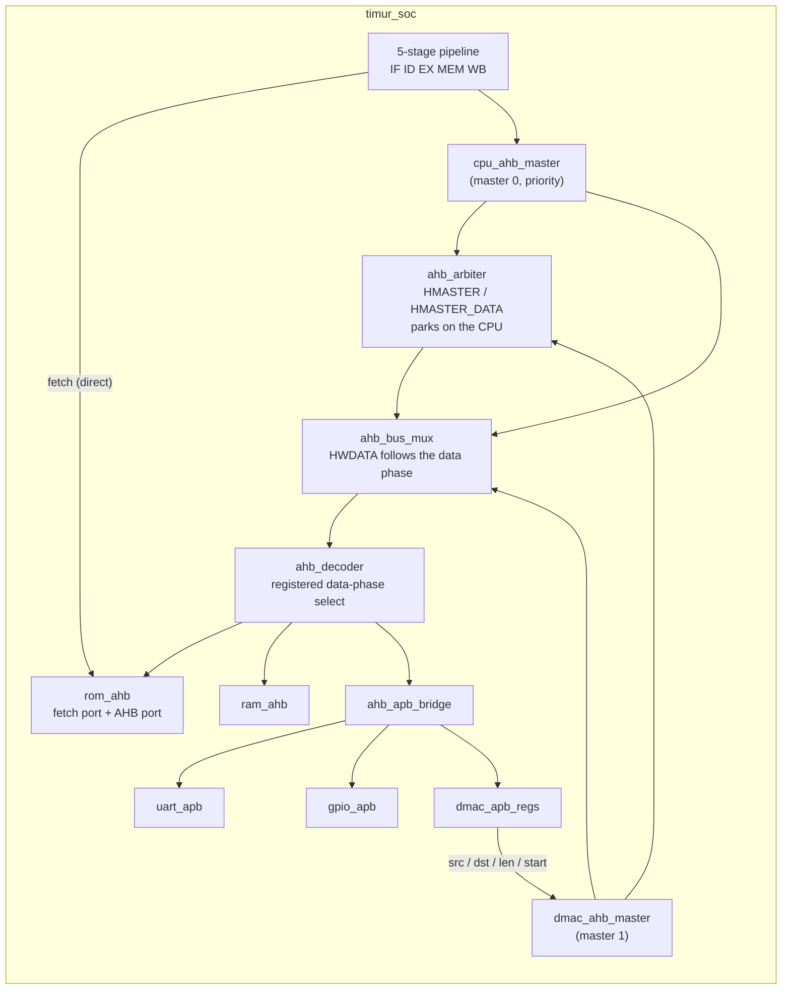

# Timur-RV32IMC

> A pipelined RISC-V RV32IMC microcontroller in Verilog-2001 for the Terasic DE10-Lite (Intel MAX 10), with a Harvard instruction-fetch port, an AHB-Lite/APB bus fabric with DMA, GPIO and UART. *Timur* means "iron" in Old Turkic.

---

## Table of Contents

- [Timur-RV32IMC](#timur-rv32imc)
  - [Table of Contents](#table-of-contents)
  - [Overview](#overview)
  - [Architecture](#architecture)
  - [ISA Support](#isa-support)
  - [Current Status](#current-status)
  - [Module Structure](#module-structure)
    - [Phase 1 — Primitives and Verification Infrastructure](#phase-1--primitives-and-verification-infrastructure)
    - [Phase 2 — Execution Datapath](#phase-2--execution-datapath)
    - [Phase 3 — State and Memory](#phase-3--state-and-memory)
    - [Phase 4 — Instruction Decode and Control](#phase-4--instruction-decode-and-control)
    - [Phases 5–7 — Pipeline and Hazard Resolution](#phases-57--pipeline-and-hazard-resolution)
    - [Phase 8 — APB Peripherals](#phase-8--apb-peripherals)
    - [Phase 9 — AHB Bus Fabric and System](#phase-9--ahb-bus-fabric-and-system)
    - [Phases 10–12 — Planned](#phases-1012--planned)
  - [Address Map](#address-map)
  - [Pipeline Design](#pipeline-design)
  - [Hazard Handling](#hazard-handling)
  - [Peripherals](#peripherals)
    - [GPIO](#gpio)
    - [UART](#uart)
    - [DMAC](#dmac)
  - [Tool Stack](#tool-stack)
  - [Simulation](#simulation)
    - [Running all tests](#running-all-tests)
    - [Testbench conventions](#testbench-conventions)
    - [System tests and test programs](#system-tests-and-test-programs)
  - [Building \& Programming](#building--programming)
  - [C Software Layer](#c-software-layer)
  - [Development Phases](#development-phases)
  - [Directory Structure](#directory-structure)
  - [License](#license)

---

## Overview

| Item | Value |
| ---- | ----- |
| ISA | RV32IMC + Zicsr, machine mode only (C and Zicsr from Phases 10–11) |
| Pipeline | 5-stage in-order: IF, ID, EX, MEM, WB; full forwarding; control transfers resolved in EX |
| Instruction path | Dedicated fetch port into the on-chip ROM (Harvard fetch, never waits for the bus) |
| Data path | AHB-Lite slaves behind a two-master arbiter (CPU data port with priority, DMAC) using AMBA 2-style HBUSREQ/HGRANT arbitration; APB peripherals behind a bridge |
| Memory | 64 KB instruction ROM + 64 KB data RAM in M9K blocks |
| Peripherals | GPIO (LEDs, switches), UART (115200 8N1), DMA controller |
| Board | Terasic DE10-Lite, Intel MAX 10 `10M50DAF484C7G` |
| Clock | 50 MHz from ALTPLL (Fmax to be measured; see [Current Status](#current-status)) |

---

## Architecture



The board wrapper `Timur_RV32IMC` contains only `cpu_pll`, the reset gating (button AND PLL locked), `reset_sync` and `timur_soc`. Testbenches instantiate `timur_soc` and drive its clock and reset directly.

---

## ISA Support

| Extension | Description | Status |
| --------- | ----------- | ------ |
| **RV32I** | Base integer instructions | ✅ Implemented (Phases 2–7) |
| **RV32M** | MUL, MULH, MULHSU, MULHU (2 cycles), DIV, DIVU, REM, REMU (35 cycles) | ✅ Implemented (Phase 2) |
| **Zicsr** | CSRRW, CSRRS, CSRRC and immediate forms | Decoded (Phase 4); CSR file in Phase 10 — until then CSR reads return 0 |
| **M-mode** | Traps, precise exceptions, ECALL/EBREAK/MRET, `mtvec`, `mepc`, `mcause` | 🔜 Phase 10 (ECALL, EBREAK, MRET are decoded and retire as NOPs) |
| **RV32C** | 16-bit compressed instructions | 🔜 Phase 11 |

Unrecognised encodings (including `0x00000000`) raise `Illegal` in decode and retire with every side effect disabled; Phase 10 turns this into an illegal-instruction trap.

---

## Current Status

**Phases 1–9 implemented and verified in simulation.**

| Phase | Description | Status |
| ----- | ----------- | ------ |
| 1 | Primitives and verification infrastructure | ✅ Simulation |
| 2 | Execution datapath | ✅ Simulation |
| 3 | State and memory | ✅ Simulation |
| 4 | Decode and control | ✅ Simulation |
| 5 | Single-cycle integration | ✅ Simulation (superseded by the pipeline) |
| 6 | Five-stage pipeline | ✅ Simulation |
| 7 | Hazard resolution | ✅ Simulation |
| 8 | APB peripherals | ✅ Simulation |
| 9 | AHB fabric and system | ✅ Simulation |
| 10 | CSRs, traps, machine mode | 🔜 Next |
| 11 | C extension | 🔜 |
| 12 | C software layer | 🔜 |

Checklist items that need Quartus or the board and are still open:

- Phase 1: SDC registered and the PLL clock visible in Timing Analyzer.
- Phase 2: Embedded Multiplier 9-bit element count from the Flow Summary.
- Phases 3/5: ROM and RAM inferred as M9K (about 128 of 182 blocks), Analysis & Synthesis clean.
- Phase 5: positive slack at 50 MHz; record Fmax from the Slow 1200mV 85C model together with evidence that the datapath was synthesised (128 M9K blocks, embedded multipliers in use, the LE count, the critical path). The earlier 296 MHz figure is withdrawn: it is too close to the M9K limit for a real single-cycle datapath. With a single-cycle MUL the design reached only 30.4 MHz (slack −12.9 ns: load data forwarded from WB ran through the multiply array, the ALU result mux and the zero flag into the branch redirect and the ROM fetch address), so MUL now registers its operands and stalls one cycle in EX like the divider. A trial compile gives 51.6 MHz (setup slack +0.60 ns, hold +0.40 ns). The critical path is load data forwarded from WB into the branch compare, the redirect and the ROM fetch address. The margin is small and moves by about ±0.5 ns with the fitter seed; high-performance effort with physical synthesis (combinational, register duplication, retiming) keeps it positive across seeds (worst of three +0.42 ns). If later phases lose it, lower the PLL frequency.
- Phase 7: riscv-arch-test RV32I and M suites (RISCOF flow).
- Phase 9: post-fit timing; on the board — LEDs follow software, UART output readable, DMA checksum correct.

---

## Module Structure

### Phase 1 — Primitives and Verification Infrastructure

- **`mux2`, `mux4`** — parameterised multiplexers (default `WIDTH` 32).
- **`d_ff`** — D flip-flop with enable and asynchronous active-low reset.
- **`reset_sync`** — two-flop reset synchroniser: asynchronous assertion, release on the second rising edge.
- **`cpu_pll`** — ALTPLL (50 MHz in, `c0` 50 MHz out, `areset` and `locked` used). Added to the project through `cpu_pll.qip`; `cpu_pll_bb.v` is excluded from synthesis and simulation.
- **`run_tests.tcl` / `run_tests.bat`** — ModelSim regression runner (see [Simulation](#simulation)); `Timur_RV32IMC.sdc` — timing constraints.

### Phase 2 — Execution Datapath

- **`adder_32bit`** — add/subtract; B is inverted with an XOR against `sub`, which is also the carry-in (carried in an extra low bit, so the sum is one carry chain). Outputs `cout` (1 = no borrow) and signed `overflow`.
- **`barrel_shifter`** — a left and a right shifter side by side, each five cascaded `mux2` stages (one `shamt` bit per stage); a final `mux4` on `shift_type` picks the result. Every stage is one 2:1 mux deep. The right shifter fills with the original `in[31]` for SRA.
- **`multiplier`** — two cycles: both operands are extended to 33 bits with a sign bit or zero, and one signed 33×33 multiply serves MUL, MULH, MULHSU and MULHU. `start` registers the extended operands in the first EX cycle (the embedded multipliers' input registers) and the product is formed from them in the second, so late forwarded load data never passes through the multiply array in the same cycle. `done` is a level held until `ack`, as in the divider.
- **`divider`** — restoring divider, 32 iterations; divide by zero and `0x80000000 / -1` take a fast path. The DIV sits in EX for 35 cycles (2 on the fast path). `done` is a level held until `ack` (the DIV leaving EX), so it is never lost in a bus freeze.
- **`alu`** — 5-bit `ALUControl` including SLTU (`01100`); shift type decoded explicitly; `zero` computed after the result mux. The multiplier and the divider are started with `mul_start` / `div_start` and acknowledged with `mul_ack` / `div_ack` from the hazard unit.
- **`branch_condition_evaluator`** — BEQ, BNE, BLT, BGE, BLTU, BGEU from the flags of `a - b`. In the pipeline it is fed by a dedicated compare on the forwarded operands (`rs1 - rs2` and `rs1 == rs2`), not by the ALU.

### Phase 3 — State and Memory

- **`pc`** — 32-bit `d_ff`, enable = `pc_load`; all next-PC selection lives outside it.
- **`registers`** — 32×32 array `regs` in logic, asynchronous reads, x0 forced to 0 through a `mux2` per port, and a write-through bypass: a same-cycle WB write is returned on the read ports.
- **`rom_ahb`** — one 16384×32 dual-port ROM (`ram_init_file = "rom.mif"` for synthesis; zero fill plus `rom.hex` in simulation). Fetch port for IF; read-only AHB-Lite slave port for loads and DMAC reads (writes ignored).
- **`ram_ahb`** — four 16384×8 byte lanes; synchronous read in the address phase, write in the data phase on the enabled lanes, read-after-write bypass for a load right behind a store to the same word, raw 32-bit `HRDATA`.
- **AHB-Lite slave convention** — every slave has an `HREADY` input and an `HREADYOUT` output and accepts an address phase only with `HSEL & HTRANS[1] & HREADY`.
- **`store_aligner`** (MEM) and **`load_formatter`** (WB) — byte/halfword replication for stores, lane selection and sign/zero extension for loads. `HSIZE` carries only the size.

### Phase 4 — Instruction Decode and Control

- **`instr_parser`** — field slicing (`opcode`, `rd`, `funct3`, `rs1`, `rs2`, `funct7`).
- **`imm_gen`** — I, S, B, U, J immediates (bit 0 of B and J is 0).
- **`alu_decoder`** — uses opcode bit 5 (`op5`): for I-type arithmetic `funct7` holds immediate bits, so `ADDI x1, x0, -5` stays ADD and `ADDI x1, x0, 40` does not become MUL.
- **`main_control_unit`** — `RegWrite`, `ALUSrcA` (rs1 / PC / zero), `ALUSrcB`, `ALUOp`, `MemRead`, `MemWrite`, `MemToReg`, `Branch`, `Jump`, `Jalr`, `CSRAccess`, `CSROp`, `CSRImm`, `IsECALL`, `IsEBREAK`, `IsMRET`, `Illegal`. SYSTEM is decoded on the full `funct12` (ECALL, EBREAK, MRET, WFI as NOP); FENCE and FENCE.I are NOPs; reserved encodings raise `Illegal` and force every side-effect control to 0.

### Phases 5–7 — Pipeline and Hazard Resolution

The datapath lives in **`timur_soc`**:

- **Fetch** — `fetch_addr = NOT rst_n ? 0 : (pc_load ? pc_next : pc)`: the ROM registers the same address as the PC register, so the fetched word always belongs to the current PC and is re-read while the PC holds.
- **`if_id_reg`, `id_ex_reg`, `ex_mem_reg`, `mem_wb_reg`** — common interface (`clk`, `rst_n`, `enable`, `flush`) and a `valid` bit; priority reset → flush (bubble) → hold → capture. A bubble has every side-effect control 0; in IF/ID it holds the NOP `0x00000013`.
- **EX** — forwarding muxes, `ALUSrcA`/`ALUSrcB`, ALU, branch evaluation, branch target (PC + imm), jump target (ALU result with bit 0 cleared), redirect, result mux (PC + 4 for JAL/JALR).
- **MEM / WB** — the AHB address phase is issued in MEM and the data phase completes in WB; MEM/WB does not capture load data.
- **`forwarding_unit`** — 00 ID/EX value, 01 WB value, 10 EX/MEM result; EX/MEM wins; never for x0.
- **`hazard_detection_unit`** — produces every enable and flush; see [Hazard Handling](#hazard-handling).

### Phase 8 — APB Peripherals

- **`gpio_apb`** — GPIO_OUT (LEDs), GPIO_IN (switches through a two-flop synchroniser), GPIO_DIR.
- **`uart_apb`** — 8N1 UART with a fixed divider (433 → 115,207 baud at 50 MHz); transmitter and receiver time each bit from the start of the frame, the receiver samples at bit centres, rejects glitches and framing errors, and reports `rx_overrun`.
- **`dmac_apb_regs`** — SRC, DST, LEN, CTRL (self-clearing start, `irq_enable`), STATUS (engine busy, sticky done).

### Phase 9 — AHB Bus Fabric and System

- **`cpu_ahb_master`** — AHB master 0: NONSEQ address phase from MEM (`HBURST` SINGLE, `HPROT` 0011), `HWDATA` loaded when the address phase is accepted and held through wait states, `bus_wait` for a pending address or data phase.
- **`ahb_arbiter`** — at each rising edge with `HREADY = 1`: CPU requesting → CPU; else DMAC requesting → DMAC; else park on the CPU. Outputs `HMASTER`, `HMASTER_DATA` (data-phase owner) and `HGRANT`. No HLOCK.
- **`ahb_bus_mux`** — address/control from `HMASTER`, `HWDATA` from `HMASTER_DATA`.
- **`ahb_decoder`** — `HSEL` from `HADDR[31:16]`; `HRDATA`/`HREADY` multiplexed with a data-phase select registered when `HREADY = 1`; default slave (reads 0, writes ignored).
- **`ahb_apb_bridge`** — IDLE → SETUP → ACCESS, one wait state per APB access, APB decode on `PADDR[15:8]`, back-to-back APB transfers.
- **`dmac_ahb_master`** — IDLE, RD_ADDR, RD_DATA, WR_ADDR, WR_DATA, DONE; word copies from ROM or RAM to RAM; `LEN = 0` finishes at once; keeps its data if the CPU takes the bus between the read and the write.
- **`Timur_RV32IMC`** — board wrapper: `clk_50mhz`, `rst_btn_n`, `sw[9:0]`, `leds[9:0]`, `uart_tx`, `uart_rx`.

### Phases 10–12 — Planned

- **Phase 10** — `csr_file` and `trap_unit` in `rtl/csr/`: CSR accesses atomic in EX, precise traps taken in EX (ECALL from M-mode is cause 11), `misa = 0x40001100` (`0x40001104` after Phase 11), 64-bit `mcycle`/`minstret`.
- **Phase 11** — `decompressor` before IF/ID and a split-bank halfword ROM (`rom_lo`/`rom_hi`) so any 32-bit window starting on a halfword boundary is fetched in one cycle.
- **Phase 12** — `sw/linker.ld`, `sw/crt0.S`, `sw/syscalls.c` and the binary-to-memory converter (see [C Software Layer](#c-software-layer)).

---

## Address Map

| Range | Slave | Size | Notes |
| ----- | ----- | ---- | ----- |
| `0x0000_0000 – 0x0000_FFFF` | ROM | 64 KB | Fetch port (IF) + AHB data port (loads, DMAC reads) |
| `0x2000_0000 – 0x2000_FFFF` | RAM | 64 KB | `.data`, `.bss`, heap, stack; DMAC destination |
| `0x4000_0000 – 0x4000_00FF` | UART (APB) | 256 B | DATA `0x00`, STATUS `0x04`, CTRL `0x08` |
| `0x4000_0100 – 0x4000_01FF` | GPIO (APB) | 256 B | OUT `0x00`, IN `0x04`, DIR `0x08` |
| `0x4000_0200 – 0x4000_02FF` | DMAC registers (APB) | 256 B | SRC `0x00`, DST `0x04`, LEN `0x08`, CTRL `0x0C`, STATUS `0x10` |
| anything else | default slave | — | Reads 0, writes ignored |

APB3 has no byte strobes: peripheral registers are word-write only (a byte or halfword store writes the replicated value to the whole register), and registers are decoded on `PADDR[7:2]`.

---

## Pipeline Design

| Stage | Work | Memory / bus |
| ----- | ---- | ------------ |
| IF | Select the next PC (sequential or redirect), present the fetch address | ROM fetch port |
| ID | Parse, immediate, control, ALU decode, register read with WB bypass, load-use detection | — |
| EX | Forwarding, operand select, ALU, multiplier, divider, branch compare and evaluation, targets, redirect, result select | — |
| MEM | Store alignment; AHB address phase for loads and stores | AHB address phase |
| WB | AHB data phase, load formatting, write-back | AHB data phase |

Taken branches, JAL and JALR redirect from EX and kill exactly the two younger instructions. The redirect ends at the ROM fetch address register in the same cycle, so it is the longest path in EX. The branch compare and the targets therefore have their own adders on the forwarded operands (`rs1 - rs2`, PC + imm for branches and JAL, rs1 + imm for JALR), and the fetch-address mux applies the redirect select last.

---

## Hazard Handling

| Condition (highest first) | PC | IF/ID | ID/EX | EX/MEM | MEM/WB |
| ------------------------- | -- | ----- | ----- | ------ | ------ |
| Bus wait (freeze) | hold | hold | hold | hold | hold |
| Trap or interrupt (Phase 10) | mtvec | bubble | bubble | bubble | advance |
| Redirect taken | target | bubble | bubble | advance | advance |
| MUL / DIV EX stall | hold | hold | hold | bubble | advance |
| Load-use | hold | hold | bubble | advance | advance |
| Normal | PC + 4 | advance | advance | advance | advance |

- **Bus wait** — CPU address phase not granted or not ready, or CPU data phase with `HREADY = 0` (for example the one wait state of every APB access, or the DMAC owning the bus).
- **Multiplier** — `mul_start = MUL in EX AND NOT done AND NOT bus_wait` registers the operands; EX stall while `NOT done` (exactly one cycle outside a bus freeze); `mul_ack` when the MUL leaves EX.
- **Divider** — `div_start = DIV in EX AND NOT busy AND NOT done AND NOT bus_wait`; EX stall while `NOT done`; `div_ack` when the DIV leaves EX.
- **Load-use** — a load in EX whose `rd` (≠ x0) matches `rs1` or `rs2` of the instruction in ID: one bubble; the value then arrives by WB forwarding.
- Instruction fetch never waits for the bus.

---

## Peripherals

### GPIO

| Offset | Register | Access | Description |
| ------ | -------- | ------ | ----------- |
| `0x00` | GPIO_OUT | R/W | Drives `LEDR[9:0]` |
| `0x04` | GPIO_IN | R | `SW[9:0]` through a two-flop synchroniser |
| `0x08` | GPIO_DIR | R/W | Reserved for header pins |

### UART

| Offset | Register | Access | Description |
| ------ | -------- | ------ | ----------- |
| `0x00` | UART_DATA | R/W | Write: byte to send (ignored while `tx_busy`). Read: received byte; clears `rx_valid` and `rx_overrun` |
| `0x04` | UART_STATUS | R | bit 0 `tx_busy`, bit 1 `rx_valid`, bit 2 `rx_overrun` |
| `0x08` | UART_CTRL | R/W | bit 0 `rx_enable`, bit 1 `rx_irq_enable` |

All UART registers reset to 0, so the receiver starts disabled; software sets `rx_enable` before the first read. The DE10-Lite has no USB-UART bridge: connect a **3.3 V** USB-to-TTL adapter (FT232R, CP2102 or CH340) to the GPIO header — see [Building & Programming](#building--programming).

### DMAC

| Offset | Register | Access | Description |
| ------ | -------- | ------ | ----------- |
| `0x00` | DMAC_SRC | R/W | Source byte address (word-aligned): ROM or RAM |
| `0x04` | DMAC_DST | R/W | Destination byte address (word-aligned): RAM |
| `0x08` | DMAC_LEN | R/W | Number of 32-bit words; 0 = no transfer, done set at once |
| `0x0C` | DMAC_CTRL | R/W | bit 0 start (self-clearing, ignored while busy), bit 1 `irq_enable`; any write clears done |
| `0x10` | DMAC_STATUS | R | bit 0 busy, bit 1 done (sticky) |

Typical use: copy the `.data` section from ROM to RAM at boot, the hardware version of the `crt0` copy loop.

---

## Tool Stack

| Purpose | Tool |
| ------- | ---- |
| HDL | Verilog-2001 |
| Synthesis, fitting, timing | Quartus Prime Lite 25.1std (Timing Analyzer with `Timur_RV32IMC.sdc`) |
| Simulation | ModelSim-Intel FPGA Starter Edition 2020.1 (standalone), driven by `run_tests.tcl`; Questa-Altera FPGA Starter Edition is an acceptable replacement |
| PLL | ALTPLL via the IP Catalog (`cpu_pll.v` + `cpu_pll.qip`) |
| Memory initialisation | `rom.mif` (synthesis), `rom.hex` (simulation), both from the same program |
| Test programs | `sw/gen_soc_tests.py` (Python 3): assembler, reference model and vector writer |
| Software (Phase 12) | xPack `riscv-none-elf-gcc` 14.2.0-3 or later (one pinned release) |
| On-chip debug | Signal Tap Logic Analyzer |

---

## Simulation

### Running all tests

Double-click `run_tests.bat` or run it from a terminal. It changes to the project folder and starts `C:\intelFPGA\20.1\modelsim_ase\win32aloem\vsim.exe -c -do run_tests.tcl`, which:

1. collects `rtl/*.v` and `rtl/*/*.v` (dropping every `*_bb.v`) and `tb/*_tb.v`;
2. deletes, recreates and maps the `work` library;
3. compiles everything once and aborts on any compile error;
4. runs each testbench through a temporary do-file (`run -all`, `quit -sim`), with its transcript in `logs/<testbench>.log`;
5. counts a test as passed only if its log contains `ALL n TESTS PASSED` with n > 0 and no `FAIL` line — a crash, a missing vector file or a watchdog timeout leaves no summary line and fails;
6. prints a summary and deletes the temporary do-files.

Paths inside testbenches (`vectors/…`, `rom.hex`) are relative to the project root.

### Testbench conventions

- One `tb/<module>_tb.v` per module and one `vectors/<module>_vectors.txt`; lines starting with `//` are comments, and lines whose field count does not match are skipped.
- Sequential vectors end with a `wait_type` column: `0` = check 3 ns after applying inputs without a clock edge, `1` = wait for the next rising edge plus 1 ns, then check. Protocol testbenches may use `x` digits in expected values for "don't care".
- Every testbench starts with `` `timescale 1ns/1ps``, has a watchdog that prints a `FAIL` line, compares with `!==`, prints one `PASS`/`FAIL` line per vector, and ends with exactly `ALL n TESTS PASSED` or `f / n TESTS FAILED` followed by `$stop`. A run with no vectors is a failure.

### System tests and test programs

`tb/timur_soc_tb.v` runs the programs listed in `vectors/timur_soc_vectors.txt` on `timur_soc`:

| Program | Covers |
| ------- | ------ |
| `timur_soc_phase5.hex` | The Phase 5 test program (no loads) |
| `timur_soc_phase6.hex` | Loads and stores of every size and offset, JAL/JALR links, LUI/AUIPC, register-file bypass |
| `timur_soc_phase7.hex` | Forwarding, load-use, the Phase 7 walkthrough (LW, dependent ADD, DIV, taken branch), DIV/REM (including an operand from an APB load and REM by zero after an APB load), MUL (including an operand straight from a RAM load), taken branch/JAL/JALR killing exactly two instructions — once normally and once with HREADY held low for three cycles in every RAM load |
| `timur_soc_random.hex` | Random dependency-dense program (RAM and APB loads/stores, ROM loads, DIV/REM corner cases, branches, JAL, JALR), with and without HREADY waits |
| `timur_soc_system.hex` | GPIO, UART, DMA copy while the CPU runs loads and stores, DMAC STATUS busy/done, `LEN = 0`, default slave |
| `rom.hex` | The final cross-phase program (the default ROM image), checked against its expected state before Phase 10 |
| `sw/bringup/bringup_*.hex` | The three hardware bring-up programs (see [Building & Programming](#building--programming)) |

Every cycle of every program the testbench also checks that the fetch word matches ROM[PC] and the IF/ID word matches ROM[IF/ID pc], that each MUL gets one multiplier start and one stall cycle, that each DIV gets exactly one divider start and that each load-use costs exactly one bubble. Expected registers, RAM words and the order in which instructions leave EX come from the reference model in `sw/gen_soc_tests.py`; programs whose results depend on timing (UART, DMAC polling) have hand-written expectations.

Add `+trace` to the `vsim` command line to print PC, instruction and x1–x14 every cycle.

To regenerate the program images, `vectors/timur_soc_vectors.txt`, `rom.hex`, `rom.mif` and the bring-up programs, run from the project root:

```bash
python3 sw/gen_soc_tests.py              # default seed 20260926
python3 sw/gen_soc_tests.py --seed 42    # another random program; the seed is recorded in the vector file
```

---

## Building & Programming

1. Open `Timur_RV32IMC.qpf` in Quartus Prime Lite 25.1std.
2. Run **Processing → Start Compilation**.
3. Check **Timing Analyzer → Slow 1200mV 85C Model → Setup Summary / Fmax Summary**: slack must be positive, with 0 illegal and 0 unconstrained clocks.
4. Check **Fitter → Resource Section → RAM Summary** for the M9K blocks and **Flow Summary** for the Embedded Multiplier 9-bit elements.
5. Program the `.sof` from `output_files/` with **Tools → Programmer**.

Pins (DE10-Lite golden top, 3.3-V LVTTL):

| Port | Board signal |
| ---- | ------------ |
| `clk_50mhz` | `MAX10_CLK1_50` (PIN_P11) |
| `rst_btn_n` | `KEY[0]` (PIN_B8), active low |
| `sw[9:0]` | `SW[9:0]` |
| `leds[9:0]` | `LEDR[9:0]` |
| `uart_tx` | `GPIO[0]` (PIN_V10), header pin 1 → adapter RX |
| `uart_rx` | `GPIO[1]` (PIN_W10), header pin 2 ← adapter TX |

Use a 3.3 V adapter only (never 5 V) and connect its ground to a GND pin of the GPIO header. Terminal settings: 115200 8N1.

Hardware bring-up order (copy the program's `.mif` over `rom.mif`, and its `.hex` over `rom.hex` for simulation, then recompile):

| Step | Program | Expected on the board |
| ---- | ------- | --------------------- |
| 1 | `sw/bringup/bringup_1_gpio.mif` | LEDs mirror the switches; with every switch off they show `0x2A5` |
| 2 | `sw/bringup/bringup_2_uart.mif` | `UUUU…` in the terminal, a square wave on `uart_tx` |
| 3 | `sw/bringup/bringup_3_dma.mif` | DMA copies four ROM words to RAM; the LEDs show the checksum's low bits `0x2AA` |
| 4 | `rom.mif` (as shipped) | Final cross-phase program: LEDs show 42 (`0b00_0010_1010`), one `U` on the UART |

---

## C Software Layer

Phase 12 (planned). Toolchain and flow:

- xPack `riscv-none-elf-gcc`, one pinned release (14.2.0-3 or later); check with `-print-multi-directory` that the `rv32im/ilp32` (later `rv32imc/ilp32`) library is used, never the default `rv32imac`.
- `-march=rv32im_zicsr` before Phase 11, `-march=rv32imc_zicsr` after it (without `_zicsr` the CSR instructions in `crt0` do not assemble), `-mabi=ilp32`, `-O2 -ffunction-sections -fdata-sections`, `-nostartfiles -T linker.ld`, `--specs=nano.specs`, `-Wl,--gc-sections -Wl,-Map=program.map`.
- Link through the gcc driver, not `ld` directly.
- `crt0.S` loads `gp`, sets `sp`, sets a 4-byte-aligned `mtvec`, copies `.data`, clears `.bss` and calls `main`; the converter writes `rom.hex` and `rom.mif` (unused words `00000000`).

---

## Development Phases

```text
Phase 1  ✅  Primitives and verification infrastructure
Phase 2  ✅  Execution datapath (ALU, multiplier, divider, branch evaluator)
Phase 3  ✅  State and memory (PC, register file, ROM, RAM, load/store helpers)
Phase 4  ✅  Decode and control
Phase 5  ✅  Single-cycle integration
Phase 6  ✅  Five-stage pipeline
Phase 7  ✅  Hazard resolution
Phase 8  ✅  APB peripherals (GPIO, UART, DMAC registers)
Phase 9  ✅  AHB fabric and system (arbiter, bus mux, decoder, bridge, DMA engine)
Phase 10 🔜  CSRs, traps, machine mode   ← Next
Phase 11 🔜  C extension (decompressor, split-bank ROM)
Phase 12 🔜  C software layer (linker script, crt0, syscalls, converter)
```

✅ = implemented and verified in simulation; the Quartus and board checks listed under [Current Status](#current-status) are still open.

---

## Directory Structure

```text
Timur-RV32IMC/
├── rtl/
│   ├── primitives/   # mux2, mux4, d_ff, reset_sync, cpu_pll (+ .qip; cpu_pll_bb.v not used)
│   ├── execute/      # adder_32bit, barrel_shifter, multiplier, divider, alu, branch_condition_evaluator
│   ├── state/        # pc, registers
│   ├── memory/       # rom_ahb, ram_ahb
│   ├── decode/       # instr_parser, imm_gen, alu_decoder, main_control_unit
│   ├── pipeline/     # if_id_reg, id_ex_reg, ex_mem_reg, mem_wb_reg, forwarding_unit,
│   │                 # hazard_detection_unit, store_aligner, load_formatter
│   ├── bus/          # cpu_ahb_master, ahb_arbiter, ahb_bus_mux, ahb_decoder, ahb_apb_bridge, dmac_ahb_master
│   ├── periph/       # gpio_apb, uart_apb, dmac_apb_regs
│   ├── csr/          # csr_file, trap_unit (Phase 10)
│   └── top/          # Timur_RV32IMC (board wrapper), timur_soc
├── tb/               # <module>_tb.v, one per module
├── vectors/          # <module>_vectors.txt and the timur_soc program images
├── sw/               # gen_soc_tests.py, bringup/ (Phase 12 adds linker.ld, crt0.S, syscalls.c, converter)
├── rom.hex, rom.mif  # default ROM image (final cross-phase program)
├── ram.mif
├── run_tests.tcl, run_tests.bat
├── Timur_RV32IMC.qpf, Timur_RV32IMC.qsf, Timur_RV32IMC.sdc
└── README.md
```

---

## License

This project is developed for educational purposes. See [LICENSE](LICENSE) for details.
